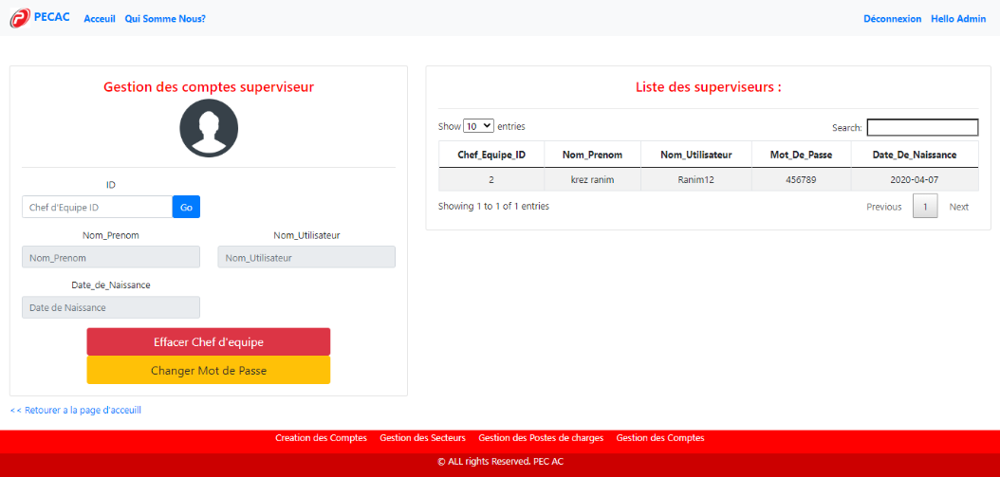
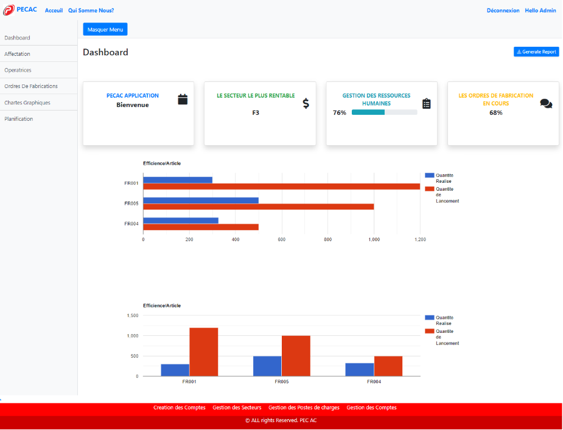
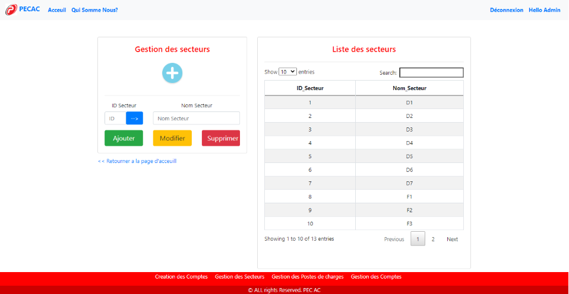
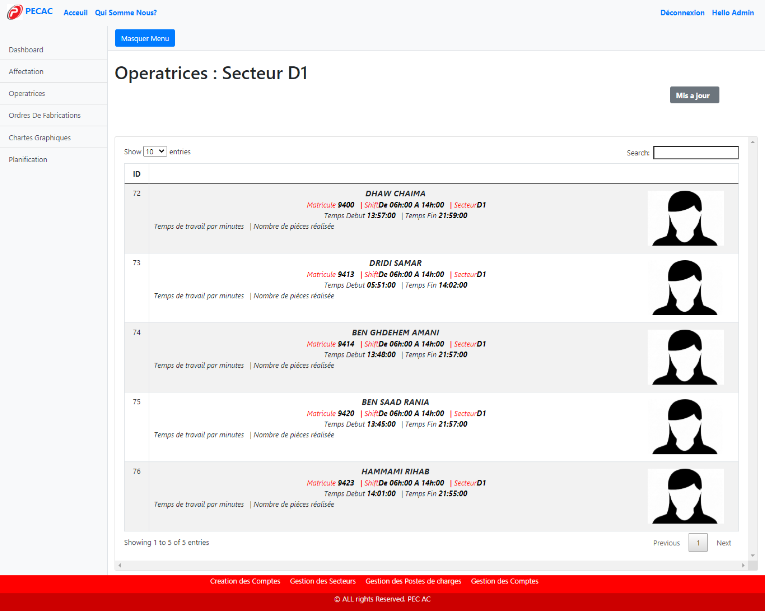

# Production Management

## App Overview
* The objective of production management applications is to manage production planning in order to optimize costs, minimize production line breaks and meet deadlines using ASP.NET MVC.

## Requirements to run
To test the app, please install Microsoft Visual Studio 2019, SQL Server```

```

## Functions

### Modify informations of employees
</img>
<br>

### Dashboard
</img>
<br>


### Sectors management
</img>
<br>

###Employees informations
</img>

## Built With
* IDE - *Microsoft Visual Studio Enterprise 2017*
* Database - *SQL Server*
* Language - *C#*
* Frameworks - *ASP.NET  MVC
